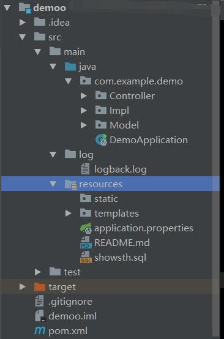
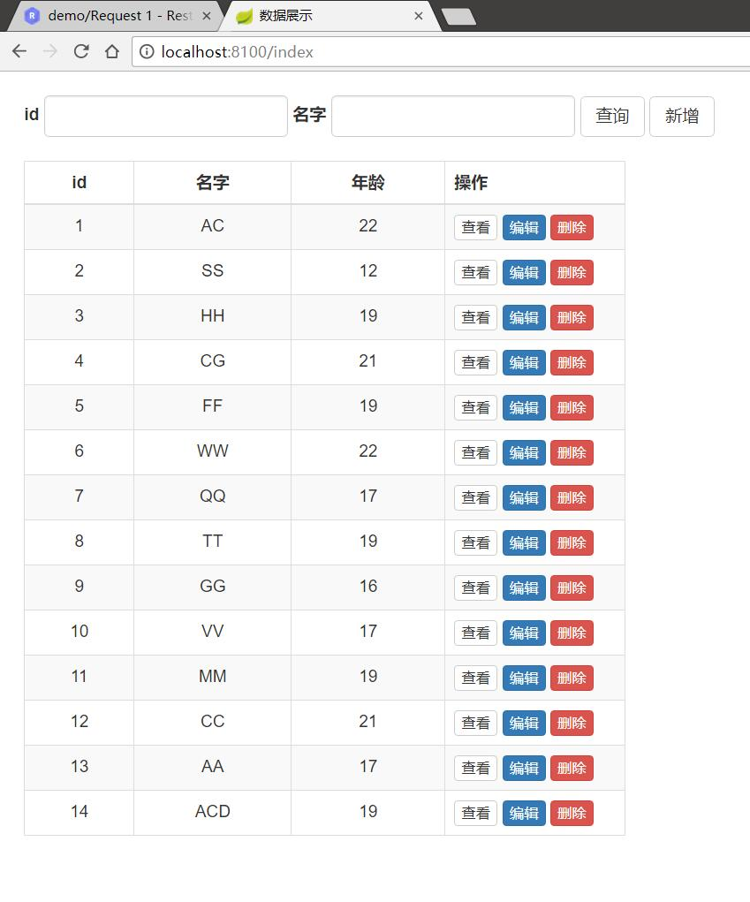
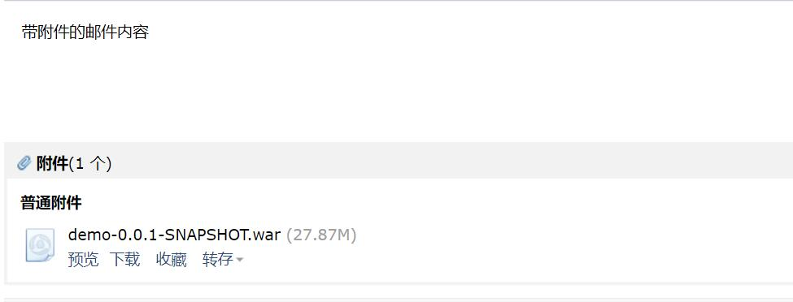

# 第一次面试被干懵的记录
## 面试题

用Java设计出显示数据库内容的界面，有单记录打印功能。

要求：

①WebPage显示数据库表或视图内容的界面；

②根据界面输入的信息进行模糊查询，显示符合条件的数据；

③显示单条记录具体内容,设计出单条记录报表打印内容更佳；

④能够使用字段编码（压缩）存储图片和文档则更佳；

⑤页面后台调用数据库存储过程，输出调用结果。

⑥调试好的代码和执行程序打包压缩邮件发回。

## 理解
看到的第一眼完全不知所云,仔细想想觉得应该就是做一个的页面, 
1. 能显示数据库并能做增删改查
2. 能够String流接收文件并压缩
3. 能按时间打印log文件,调试时能在Terminal里打印
4. 能打包代码并通过邮件发送到指定邮箱

## 折腾
当天三点拿到题,懵了一下午,SSM环境搭的崩溃, 
配置完mybatis genertor生成的Mapper和Entity太乱了,一调用就报错 
这个过程中才发现自己对于几个框架真正干了什么感觉陌生,之前学习的时候还是太少,具体自己来思考怎么写就傻了 
搭到夜晚,甚至都想放弃这家工作室,删掉了第二轮的架子.想想反正有了一个需求让我自觉动起来,就当作练手了 
So,使用才学没两天的springBoot搭这种小服务最好不过了,甚至推荐的JPA都是昨晚才看的文档233 
感觉很多细节写的很糙,但是这种面试方法确实是比较酷的锻炼方式,决定以后多动手做一些小需求来认识工具的使用 

## 使用说明
1. 项目使用的Intellij IDEA + Maven + SpringBoot +JPA搭建,使用Restlet_Client测试
2. 使用SpringBoot的三种方式(IDEA最佳)在本地启动后浏览`localhost:8100/index`进行查看
3. 使用`localhost:8100/upload`进行上传文件,上传到`resources/static`目录下,遗憾的是尝试了很多方法都不能让其中的GZip生效,所以并不能压缩
4. 请使用 ` mvn clean package  -Dmaven.test.skip=true` 打包,会在`target`目录下生成war包文件
5. 查询的日志文件会自动生成于`src/main/log/logback.log`并在200kb左右压成gz包
6. 项目的数据表由JPA配置后自动生成,填充测试数据即可,可参考resources目录下sql文件
7. 关于邮件请配置好对应的协议和邮箱类对应协议的验签

* 项目结构

  

* 数据查看页面
  
  

* 邮件接收war附件
  
  

## 总结
来天津也有快一个月了,担心自己基础不好就没敢海投,所以心态还是在一些知识点,失败 
陆陆续续接到三五个面试通知,觉得不靠谱就给拒了,May10th同时接到两个Offer面试,另一个市区太远也拒了 
所以这就是我第一次的面试总结了,不得不说社招从来不玩虚的,非常赞同这种直接做项目的方式考察,虽然我也短路了 
清楚的认识到了自己的短处和误区在哪,比如SSM框架的直接应用,前端页面也变得更陌生了 
最重要的是自己想学的太多,作为一个初级这完全是在坑自己,规划的再好也不行 
在处理多重BUGERROR的情况下,心态变的浮躁,需要注意不被干扰 
做完整个下来收获了不少,对面试也算有了概念,就算被拒也是值得了

